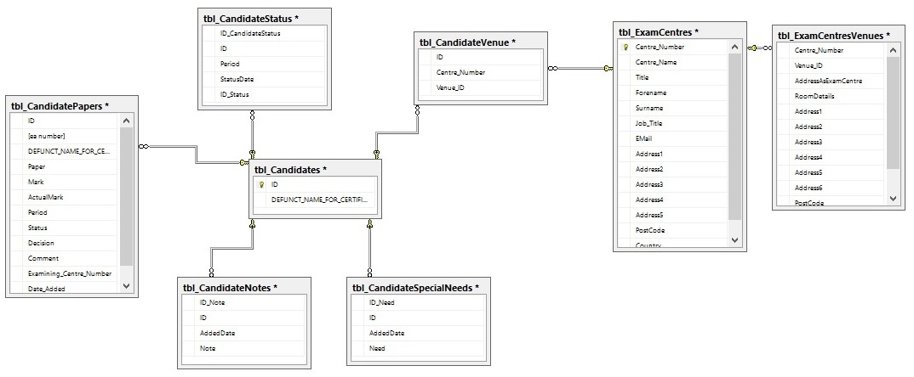
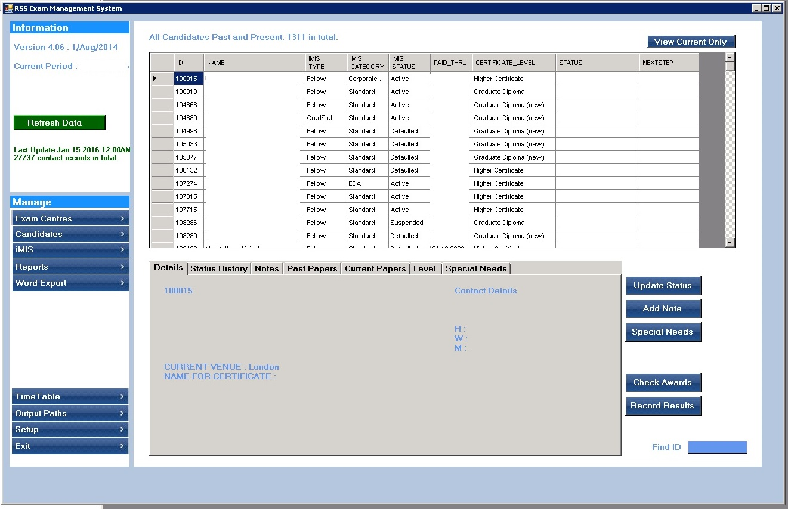
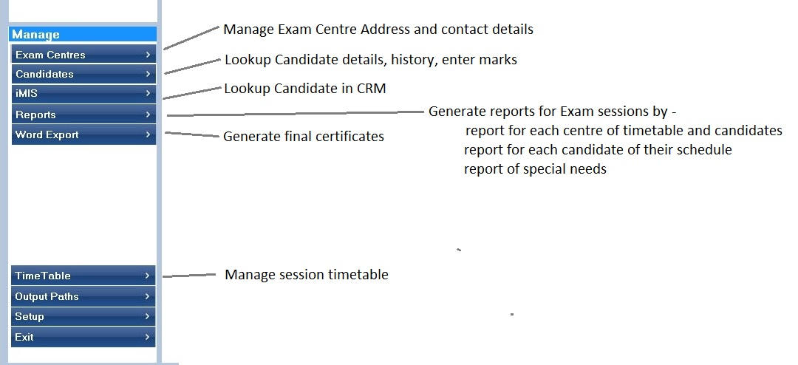

```{r setup, include=FALSE}
knitr::opts_chunk$set(echo = TRUE)
```
## Database
A SQL Server database holds information for the objects in the system - Candidates, Exams Centres, Venues within the centre, Session timetables, and results. A partial EAR diagram is shown below. 



<hr size="15">

## User Interface - Main Menu
A Management system written in VB.Net allows the information to be managed efficiently.
 


<hr size="15">

## User Interface - Management Functions
Each area to be managed has it's own area

 
